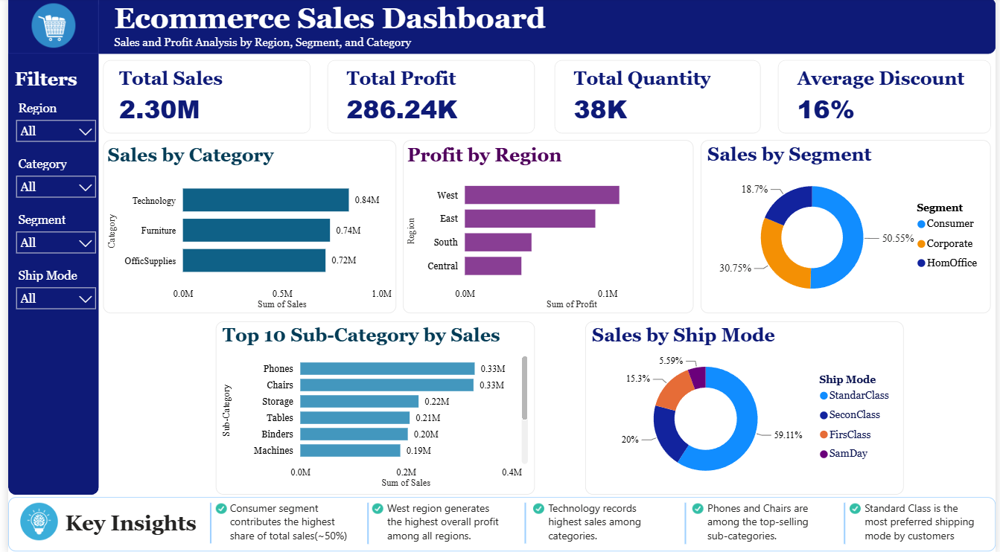

# Ecommerce Sales Dashboard (Power BI)

## Overview

This project presents an interactive Ecommerce Sales Dashboard built in Power BI to analyze sales performance, profitability, customer behavior, and regional trends using the Sample Superstore dataset.

## Features

- Sales and Profit Analysis
- Category & Sub-Category Performance
- Regional Sales Insights
- Interactive Filters & Slicers
- KPI Cards
- Trend Analysis

## Tools Used

- Power BI
- Microsoft Excel
- Data Cleaning
- Data Modeling
- DAX
- Data Visualization

## Dataset

Sample Superstore Dataset

## Dashboard Insights

- Identified top-performing categories.
- Compared regional sales performance.
- Analyzed profit trends.
- Visualized customer purchasing patterns.

## Files

- Ecommerce Sales Dashboard.pbix
- SampleSuperstore.xlsx

## Dashboard Preview

